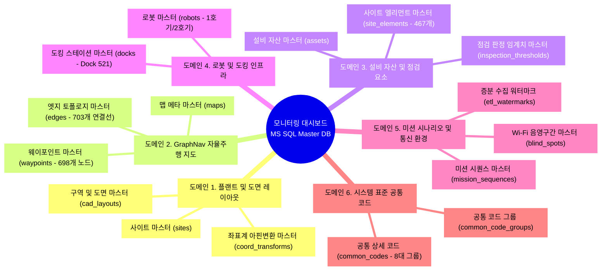
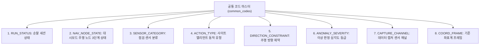
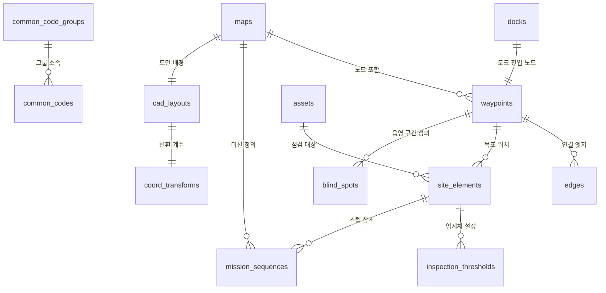
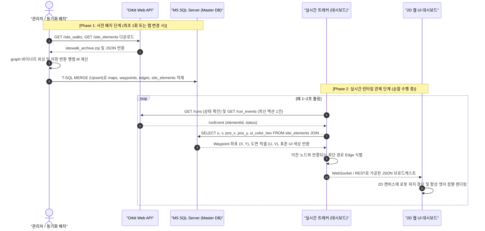
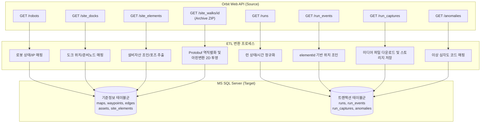
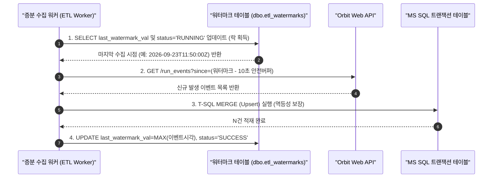

# Orbit Web API 연계 모니터링 대시보드: 기준정보(Master Data) 및 공통 코드(Code Master) DB 설계 및 구현 방안

- **문서 번호**: DOC-ORBIT-MASTER-001
- **작성일자**: 2026-09-23
- **버전**: v1.5.0 (증분 적재를 위한 Watermark Table 관리 방식 설계 추가)
- **적용 RDBMS**: **Microsoft SQL Server 2019 / 2022 (T-SQL)**
- **적용 백엔드**: **Python Flask 3.x** (REST API, Blueprint, CORS, Scoped Session)
- **적용 시스템**: Boston Dynamics Spot / Orbit 연계 2D 디지털 트윈 관제 대시보드
- **저장 위치**: `OrbitAPI_GET/src/docs/Orbit_대시보드_기준정보_마스터_DB_설계_및_구현방안_001.md`

---

## 1. 추진 배경 및 기준정보(Master Data) DB의 필요성

### 1.1 배경 및 문제점
Orbit Web API는 기본적으로 **실행 중심의 동적 트랜잭션 데이터(Dynamic Transaction Data)**(예: 순찰 이력 `runs`, 발생 이벤트 `run_events`, 캡처 미디어 `run_captures`)를 조회하는 상위 REST API입니다.
그러나 2D 디지털 트윈 대시보드에서 로봇의 실시간 위치를 도면에 투영하고, 이동 궤적을 렌더링하며, 점검 설비의 상태를 시각화하기 위해서는 Orbit API 단독 호출만으로는 다음과 같은 한계가 발생합니다:

1. **실시간 연속 좌표 부재**:
   - Orbit API에는 로봇의 실시간 (X, Y, Z) 연속 좌표를 제공하는 단일 REST 엔드포인트가 없습니다.
2. **대용량 파일 중복 다운로드 병목**:
   - 3D 지도(`graph`)와 미션 시나리오(`*.walk.json`)가 압축된 `sitewalk_archive_*.zip` 파일은 수십~수백 MB에 달하므로 대시보드 구동 시마다 실시간 API로 내려받는 것은 불가능합니다.
3. **설비 메타데이터 및 2D 도면 좌표 누락**:
   - Orbit의 `run_events` 응답에는 해당 점검 설비가 공장 도면의 어느 픽셀 (U, V)에 위치하는지, 어떤 비즈니스 관리 코드(설비 자산 ID, 정상/이상 임계치 등)를 가지는지에 대한 정보가 없습니다.

4. **시스템 상태 및 분류 코드 표준화 부재**:
   - 미션 상태(`SUCCESS`, `RUNNING`), 주행 상태(`COMPLETED`, `IN_PROGRESS`), 센서 종류(`PTZ`, `THERMAL`), 이상 등급(`WARNING`, `CRITICAL`) 등 시스템 전반에서 참조하는 코드 값이 하드코딩될 경우 유지보수성이 크게 저하됩니다.

### 1.2 기준정보(Master Data) 및 공통 코드 분리 관리의 목적
따라서 대시보드 시스템을 상용 운영급으로 안정화하기 위해서는 **정적/준정적 기준정보(Master Data)** 및 **표준 공통 코드(Code Master)**를 **MS SQL Server**에 사전에 체계적으로 모델링하여 적재하고, 런타임에는 Orbit API의 경량 이벤트(`elementId`)만 수신하여 **MS SQL DB와 초고속 조인(Join)**하는 2-Track 하이브리드 아키텍처가 필수적입니다.

```
┌────────────────────────────────────────┐       ┌────────────────────────────────────────┐
│      Orbit Web API (원격 서버)          │       │      MS SQL Server (Master DB)         │
│  (동적 런타임 트랜잭션 데이터)           │       │  (정적/준정적 기준정보 및 공통 코드)     │
│                                        │       │                                        │
│  • GET /runs (순찰 세션 상태)           │       │  • 플랜트/도면 및 아핀 변환 행렬       │
│  • GET /run_events (액션 완료 이벤트)   │ ── 조인 ──> • 698개 Waypoint 3D/2D 좌표 마스터   │
│  • GET /run_captures (미디어 URL)      │ (Key: │  • 703개 Edge 도로망 연결 토폴로지     │
│  • GET /anomalies (이상 감지 알림)     │ elementId) • 설비 자산 마스터 & 점검 임계치      │
│                                        │       │  • Spot 로봇/도킹 스테이션 제원        │
│                                        │       │  • 8대 표준 공통 코드(상태/센서/제약등)│
└────────────────────────────────────────┘       └────────────────────────────────────────┘
                                     │
                                     ▼
                ┌────────────────────────────────────────┐
                │    2D 디지털 트윈 모니터링 대시보드      │
                │  - 지연 없는 로봇 실시간 마커 표출     │
                │  - 활성 주행 엣지(Edge) 점멸 애니메이션│
                │  - 공통 코드 기반 표준화된 뱃지/색상   │
                │  - 설비별 점검 결과 팝업 및 통계 분석   │
                └────────────────────────────────────────┘
```

---

## 2. 관리 대상 기준정보(Master Data) 도메인 체계

대시보드 시스템 구현에 필요한 기준정보는 크게 **6대 도메인, 13개 마스터 엔티티**로 분류됩니다.



---

### 도메인 1. 플랜트 및 도면 레이아웃 마스터 (Plant & Layout Master)
| 엔티티명 | 테이블명 | 주요 관리 항목 | 데이터 출처 |
| :--- | :--- | :--- | :--- |
| **사이트/구역 마스터** | `sites`, `zones` | 사업장코드, 사업장명(부산사업장), 공장동(LS1/LS2), 구역코드(WEST1 등) | 플랜트 ERP/MES 기준정보 |
| **도면 레이아웃 마스터** | `cad_layouts` | 도면ID, 맵연계ID, 도면 이미지 파일 경로, 원본 해상도(width, height), 원점 오프셋 | CAD 도면 이미지 파일 |
| **좌표 변환 행렬 마스터** | `coord_transforms` | 맵ID, 변환 행렬 계수 (a, b, c, d, tx, ty), 스케일 팩터, Y축 반전 플래그, 제어 기준점(Seed Points 3쌍) | `coord_transformer.py` 캘리브레이션 결과 |

### 도메인 2. GraphNav 자율주행 지도 토폴로지 마스터 (Map Topology Master)
| 엔티티명 | 테이블명 | 주요 관리 항목 | 데이터 출처 |
| :--- | :--- | :--- | :--- |
| **맵 마스터** | `maps` | 맵 이름(`LS1_VPD (3-4)_260906`), SiteWalk UUID, 총 노드 수(698), 총 엣지 수(703), 다운로드 일시 | Orbit API `/site_walks` |
| **웨이포인트 마스터** | `waypoints` | `waypoint_id` (PK), `name` (`waypoint_31`), 3D 좌표 (pos_x, pos_y, pos_z), 쿼터니언 (rot_x, y, z, w), 헤딩 각도 (yaw_deg), **도면 투영 좌표 (u, v)**, 피듀셜 보정 노드 여부 | Protobuf `graph` + 아핀 변환 엔진 |
| **엣지 토폴로지 마스터** | `edges` | `edge_id` (PK), `from_waypoint`, `to_waypoint`, 2D 거리 (distance_2d_m), 3D 거리 (distance_3d_m), 주행 방향 제약(`direction_constraint`) | Protobuf `graph` |

### 도메인 3. 설비 자산 및 점검 요소 마스터 (Asset & SiteElement Master)
| 엔티티명 | 테이블명 | 주요 관리 항목 | 데이터 출처 |
| :--- | :--- | :--- | :--- |
| **설비 자산 마스터** | `assets` | `asset_id` (PK, 예: `B-012-1`), 설비명(특고압 수전반 #3), 설비종류(변압기/차단기/모터), 설치 구역, 관리 부서, 중요도(A/B/C) | 플랜트 설비관리시스템(EAM) |
| **사이트 엘리먼트 마스터** | `site_elements` | `element_id` (PK, UUID), `name` (표시명), 연계 `asset_id`, 목표 `destination_waypoint_id`, `action_type`(dataAcquisition/sleep), 타깃 포즈 오프셋, PTZ Pan/Tilt 파라미터 | Orbit API `/site_elements` |
| **점검 임계치 마스터** | `inspection_thresholds` | `threshold_id`, `element_id`, 센서 채널(`spot-cam-ir-raw`, `acoustic-fft`), 정상 하한치, 주의 경고치, 위험 정지치, 알림 룰 | 설비 진단 기준 규격서 |

### 도메인 4. 로봇 및 도킹 인프라 마스터 (Robot & Fleet Master)
| 엔티티명 | 테이블명 | 주요 관리 항목 | 데이터 출처 |
| :--- | :--- | :--- | :--- |
| **로봇 마스터** | `robots` | 로봇 시리얼(`spot-BD-60630130`), 닉네임(`1호기`), 모델(`SPOT`), 호스트 IP(`172.26.130.11`), 이더넷 IP, 본체 gRPC 포트(443), 운용 상태 | Orbit API `/robots` |
| **도킹 스테이션 마스터** | `docks` | `dock_id` (예: 521), 도크 타입, 전원 상태, 진입 준비 노드(`Dock 521 Prep Pose` Waypoint ID), 도크 물리 3D 위치, 도면 투영 픽셀 (u, v) | Orbit API `/site_docks` |

### 도메인 5. 미션 시나리오 및 통신 환경 마스터 (Mission & Network Master)
| 엔티티명 | 테이블명 | 주요 관리 항목 | 데이터 출처 |
| :--- | :--- | :--- | :--- |
| **미션 시퀀스 마스터** | `mission_sequences` | `mission_id`, `step_index` (0~73), `element_id`, 목표 Waypoint ID, 액션 유형, 센서 카테고리(`PTZ`, `THERMAL`, `ACOUSTIC`, `TH_SENSOR`), 점검 위치 (x, y, u, v) | `*.walk.json` (`elements`) |
| **Wi-Fi 음영지대 마스터** | `blind_spots` | `blind_spot_id`, 맵ID, 음영 시작 Waypoint ID, 음영 종료 Waypoint ID, 예상 통신 두절 시간, 로컬 버퍼링 UI 인디케이터 활성화 여부 | 현장 Wi-Fi 실측 데이터 (RF Survey) |
| **증분 수집 워터마크** | `etl_watermarks` | `job_name` (PK), `sub_key` (PK), `watermark_type`, `last_watermark_val`, `last_success_at`, `status` | ETL 수집기 런타임 체크포인트 |


### 도메인 6. 시스템 표준 공통 코드 마스터 (Common Code Master)
| 엔티티명 | 테이블명 | 주요 관리 항목 | 데이터 출처 |
| :--- | :--- | :--- | :--- |
| **공통 코드 그룹** | `common_code_groups` | `group_code` (PK), 그룹명, 그룹 설명, 사용여부 | 시스템 표준 정의 |
| **공통 상세 코드** | `common_codes` | `group_code` (FK), `code_val` (PK), 코드명(한글), 코드영문명, 정렬순서, **UI 표시 색상(HEX)**, 비고 | 시스템 표준 정의 및 Orbit Enums |

---

## 3. 시스템 공통 코드(Common Code Master) 상세 정의서 (8대 핵심 그룹)

실제 Orbit Web API 응답 데이터 및 대시보드 렌더링 엔진에서 사용하는 공통 코드 8대 핵심 그룹의 상세 명세입니다.




### [그룹 1] `RUN_STATUS` (미션 순찰 세션 상태 코드)
* **그룹 코드**: `RUN_STATUS`
* **설명**: Orbit API `GET /runs`의 `status` 필드에 매핑되는 순찰 실행 상태 코드

| 코드값 (`code_val`) | 코드명 (한글) | 영문명 | UI 색상 (HEX) | 설명 |
| :--- | :--- | :--- | :---: | :--- |
| `RUN_STATUS_RUNNING` | 순찰 진행 중 | Running | `#10ac84` (녹색 점멸) | 로봇이 미션을 수행하며 이동/촬영 중인 활성 상태 |
| `RUN_STATUS_SUCCESS` | 정상 완료 | Success | `#2ed573` (녹색) | 모든 미션 스텝을 정상 완료하고 복귀한 상태 |
| `RUN_STATUS_FAILURE` | 순찰 실패 | Failure | `#ff4757` (적색) | 장애물 고립, 페이로드 에러 등으로 미션이 실패한 상태 |
| `RUN_STATUS_STOPPED` | 강제 중단 | Stopped | `#ffa502` (황색) | 작업자 또는 안전 시스템에 의해 수동으로 중단된 상태 |
| `RUN_STATUS_PAUSED` | 일시 정지 | Paused | `#eccc68` (연황색) | 작업자 승인 대기 또는 일시 정지 상태 |
| `FAILED_DISPATCH` | 디스패치 실패 | Failed Dispatch | `#747d8c` (회색) | 로봇 바디 리스 획득 실패 또는 네트워크 오류로 기동 실패 |

---

### [그룹 2] `NAV_NODE_STATE` (대시보드 2D 주행 노드 3단계 상태 코드)
* **그룹 코드**: `NAV_NODE_STATE`
* **설명**: 2D 도면 대시보드에서 각 Waypoint 노드와 주행 엣지(Edge)를 시각화하기 위한 상태 코드

| 코드값 (`code_val`) | 코드명 (한글) | 영문명 | UI 색상 (HEX) | 설명 |
| :--- | :--- | :--- | :---: | :--- |
| `COMPLETED` | 완료 노드 | Completed | `#00d2d3` (Cyan) | Orbit API 이벤트 수신이 완료된 점검 완료 지점 |
| `IN_PROGRESS` | 진행/이동 중 | In-Progress / Moving | `#ff9f43` (Orange 점멸) | 현재 로봇이 이동 중인 목표 Waypoint 및 활성 주행 엣지 |
| `PENDING` | 대기/미수행 | Pending | `#8395a7` (반투명 회색) | 순찰 시퀀스 상 아직 도달하지 않은 대기 지점 |
| `BLIND_SPOT` | 통신 음영 지대 | Wi-Fi Blind Spot | `#ee5253` (Magenta) | Wi-Fi 통신이 일시 단절되어 로봇 로컬 버퍼링이 가동되는 구간 |

---

### [그룹 3] `SENSOR_CATEGORY` (점검 센서 및 페이로드 분류 코드)
* **그룹 코드**: `SENSOR_CATEGORY`
* **설명**: 점검 액션(Action)의 측정 대상 센서 하드웨어 및 알고리즘 분류 코드 (네이밍 접미사 규칙 연계)

| 코드값 (`code_val`) | 코드명 (한글) | 접미사 | UI 색상 (HEX) | 설명 |
| :--- | :--- | :---: | :---: | :--- |
| `PTZ` | 가시광 카메라 (고배율) | `-(P)` | `#3742fa` (청색) | Spot CAM 고배율 광학 줌 컬러 촬영 |
| `THERMAL` | 적외선 열화상 카메라 | `-(T)` | `#ff6348` (주황색) | Spot CAM IR 라디에이션 열화상 온도 측정 |
| `ACOUSTIC` | 초음파 음향 센서 | `-(M)` | `#2ed573` (녹색) | Fluke SV600 음향 빔포밍 및 주파수 이상 분석 |
| `TH_SENSOR` | 온습도/공기질 센서 | `-(A)` | `#1e90ff` (하늘색) | 환경 온습도 및 유해가스 데이터 수집 |
| `GAUGE` | 계기판 AI 판독 | `-(G)` | `#9b59b6` (보라색) | 아날로그 지침계 및 디지털 인디케이터 비전 AI 판독 |
| `GENERAL` | 일반 기본 촬영 | `-(N)` | `#57606f` (암회색) | 특정 페이로드 없는 기본 바디 카메라 촬영 |

---

### [그룹 4] `ACTION_TYPE` (사이트 엘리먼트 동작 유형 코드)
* **그룹 코드**: `ACTION_TYPE`
* **설명**: SiteElement에 내장되어 실행되는 로봇의 구체적 동작 성격

| 코드값 (`code_val`) | 코드명 (한글) | 영문명 | 비고 |
| :--- | :--- | :--- | :--- |
| `dataAcquisition` | 데이터 수집/점검 | Data Acquisition | 카메라 촬영, 센서 측정 등 측정 페이로드 트리거 (전체의 78.5%) |
| `sleep` | 포즈 대기/정지 | Sleep / Wait | 로봇이 목표 자세로 지정 시간(초) 동안 정지 상태 유지 (전체의 21.5%) |
| `dock` | 도킹 복귀/충전 | Docking | 미션 종료 후 도킹 스테이션 자동 안착 및 충전 시작 |
| `relocalize` | 피듀셜 재위치 인식 | Relocalize | AprilTag 피듀셜 마커를 인식하여 누적 주행 오차 보정 |
| `remoteMission` | 연계 원격 미션 | Remote Mission | 외부 시스템 트리거 기반 하위 미션 연계 구동 |

---

### [그룹 5] `DIRECTION_CONSTRAINT` (자율주행 엣지 경로 방향 제약 코드)
* **그룹 코드**: `DIRECTION_CONSTRAINT`
* **설명**: Protobuf Graph 바이너리에서 추출된 노드 간 주행 시 자세/방향 제약 조건

| 코드값 (`code_val`) | 코드명 (한글) | 영문명 | 설명 |
| :--- | :--- | :--- | :--- |
| `DIRECTION_CONSTRAINT_NONE` | 제약 없음 | None | 로봇이 전진/후진/측면 자유롭게 경로 생성 가능 |
| `DIRECTION_CONSTRAINT_FORWARD` | 전방 직진 강제 | Forward Only | 카메라 시야 확보 등을 위해 반드시 헤딩을 전방으로 유지 주행 |
| `DIRECTION_CONSTRAINT_REVERSE` | 후진 주행 강제 | Reverse Only | 막다른 복도 탈출 시 뒤로 돌지 않고 후진으로만 이동 |
| `DIRECTION_CONSTRAINT_NO_TURN` | 회전 금지 | No Turn | 협소 공간에서 제자리 회전 없이 직선 슬라이딩 이동 |

---

### [그룹 6] `ANOMALY_SEVERITY` (설비 이상 진단 등급 코드)
* **그룹 코드**: `ANOMALY_SEVERITY`
* **설명**: 센서 측정 결과 및 Orbit AI 이상 감지 시 부여되는 위험 심각도 등급

| 코드값 (`code_val`) | 등급명 (한글) | 레벨값 | UI 색상 (HEX) | 조치 기준 |
| :--- | :--- | :---: | :---: | :--- |
| `NORMAL` | 정상 | 0 | `#2ed573` (녹색) | 모든 측정값이 기준 임계치 이내임 |
| `WARNING` | 주의 | 1 | `#ffa502` (황색) | 정상 범위를 초과하여 추이 관찰 필요 (예: 모터 온도 60℃ 초과) |
| `CRITICAL` | 위험 / 경고 | 2 | `#ff4757` (적색) | 즉각적인 정비/점검 조치 필요 (예: 차단기 과열 80℃ 초과, 가스 누기) |

---

### [그룹 7] `CAPTURE_CHANNEL` (데이터 캡처 센서 채널 코드 - 실측 18종)
* **그룹 코드**: `CAPTURE_CHANNEL`
* **설명**: `run_events` 하위 `dataCaptures` 배열에 포함되는 데이터 파일 채널 식별자

| 채널 코드 (`code_val`) | 데이터 성격 | 포맷 | WaypointId 포함 여부 |
| :--- | :--- | :---: | :---: |
| `spot-cam-ptz` | 가시광 컬러 이미지 | JPG | `null` (대부분) |
| `spot-cam-ir-raw` | 열화상 방사 메트릭 온도 원본 | RAW | `null` |
| `spot-cam-pano` | 360도 파노라마 뷰 이미지 | JPG | `null` |
| `thermal-inspection_advanced-anomaly_isotherm_image` | 열화상 등온선 분석 이미지 | JPG | `null` |
| `acoustic-fft` | 음향 스펙트럼 FFT 변환 그래프 | JPG | **값 존재 (Not-null)** |
| `acoustic-stft` | 시간-주파수 스펙트로그램 이미지 | JPG | **값 존재 (Not-null)** |
| `acoustic-fft-json` | 음향 주파수별 dB 수치 메트릭 | JSON | **값 존재 (Not-null)** |
| `mechanical-inspection-sorx` | 음향 빔포밍 공간 에너지 파일 | SORX | `null` |
| `mechanical-inspection-video` | 점검 구간 비디오 스트림 | MP4 | `null` |
| `air_quality_csv` | 온습도 및 유해가스 농도 시계열 | CSV | `null` |
| `sensor_heatmap_temperature` | 공간 온도 분포 히트맵 이미지 | JPG | `null` |
| `sensor_heatmap_humidity` | 공간 습도 분포 히트맵 이미지 | JPG | `null` |

---

### [그룹 8] `COORD_FRAME` (기준 좌표계 프레임 코드)
* **그룹 코드**: `COORD_FRAME`
* **설명**: 3차원 위치 데이터를 계산하고 저장할 때의 기준 프레임 정의

| 코드값 (`code_val`) | 프레임명 | 설명 |
| :--- | :--- | :--- |
| `chained` | Chained BFS Frame | 도크를 원점으로 엣지 상대 변환을 BFS 순차 누적하여 구축한 전역 메트릭 좌표계 (권장) |
| `seed` | Global Seed Frame | GraphNav 지도 생성 당시의 글로벌 앵커 기준 좌표계 |
| `ko` | Kinematic Odometry Frame | 로봇 다리 관절 오도메트리 기반 로컬 키프레임 (세그먼트별 단절 발생 가능) |
| `vision` | Vision Odometry Frame | 로봇 전방/측면 카메라 비전 오도메트리 기준 로컬 좌표계 |
| `body` | Body Frame | 로봇 몸체 중심 (X: 전방, Y: 좌측, Z: 상방) 로컬 좌표계 |

---

## 4. MS SQL Server 표준 DDL 및 스키마 설계 (T-SQL)

본 스키마는 **Microsoft SQL Server (2019/2022 및 Azure SQL Database)** 환경에 최적화된 T-SQL 표준 DDL입니다.
한글 데이터의 안전한 처리를 위해 유니코드 가변 문자열(`NVARCHAR`)을 표준으로 채택하였으며, 고정밀 부동소수점 좌표 연산을 위해 `FLOAT`를 적용하였습니다.

### 4.1 전체 엔티티 관계도 (ERD)



---

### 4.2 MS SQL Server DDL 스크립트 (T-SQL)

```sql
-- =============================================================================
-- [MS SQL Server] Orbit 디지털 트윈 대시보드 기준정보 및 공통 코드 스키마
-- 스키마 기본값: dbo
-- =============================================================================

-- -----------------------------------------------------------------------------
-- 0. 공통 코드 테이블 (Code Master)
-- -----------------------------------------------------------------------------
IF OBJECT_ID('dbo.common_codes', 'U') IS NOT NULL DROP TABLE dbo.common_codes;
IF OBJECT_ID('dbo.common_code_groups', 'U') IS NOT NULL DROP TABLE dbo.common_code_groups;

CREATE TABLE dbo.common_code_groups (
    group_code      VARCHAR(50)     NOT NULL,               -- 코드 그룹 ID (예: 'RUN_STATUS')
    group_name      NVARCHAR(100)   NOT NULL,               -- 그룹명 (예: '순찰 실행 상태 코드')
    description     NVARCHAR(500)   NULL,                   -- 그룹 설명
    use_yn          BIT             NOT NULL DEFAULT 1,     -- 사용 여부 (1: 사용, 0: 미사용)
    created_at      DATETIME2(3)    NOT NULL DEFAULT SYSDATETIME(),
    CONSTRAINT PK_common_code_groups PRIMARY KEY CLUSTERED (group_code)
);

CREATE TABLE dbo.common_codes (
    group_code      VARCHAR(50)     NOT NULL,               -- 그룹 코드 FK
    code_val        VARCHAR(50)     NOT NULL,               -- 코드값 (예: 'RUN_STATUS_RUNNING')
    code_name_ko    NVARCHAR(100)   NOT NULL,               -- 한글 코드명
    code_name_en    VARCHAR(100)    NULL,                   -- 영문 코드명
    sort_order      INT             NOT NULL DEFAULT 0,     -- 정렬 순서
    ui_color_hex    VARCHAR(20)     NULL,                   -- 대시보드 표시 색상 (예: '#10ac84')
    extra_val_1     NVARCHAR(100)   NULL,                   -- 추가 속성 1 (예: 접미사 '-(P)')
    extra_val_2     NVARCHAR(100)   NULL,                   -- 추가 속성 2
    use_yn          BIT             NOT NULL DEFAULT 1,     -- 사용 여부
    remark          NVARCHAR(500)   NULL,                   -- 비고
    CONSTRAINT PK_common_codes PRIMARY KEY CLUSTERED (group_code, code_val),
    CONSTRAINT FK_common_codes_group FOREIGN KEY (group_code) 
        REFERENCES dbo.common_code_groups(group_code) ON DELETE CASCADE
);

-- -----------------------------------------------------------------------------
-- 1. 자율주행 맵 및 도면 레이아웃 마스터
-- -----------------------------------------------------------------------------
IF OBJECT_ID('dbo.coord_transforms', 'U') IS NOT NULL DROP TABLE dbo.coord_transforms;
IF OBJECT_ID('dbo.cad_layouts', 'U') IS NOT NULL DROP TABLE dbo.cad_layouts;
IF OBJECT_ID('dbo.maps', 'U') IS NOT NULL DROP TABLE dbo.maps;

CREATE TABLE dbo.maps (
    map_id          NVARCHAR(100)   NOT NULL,               -- 맵 고유 식별자 (예: 'LS1_VPD (3-4)_260906')
    sitewalk_uuid   VARCHAR(64)     NOT NULL,               -- Orbit SiteWalk UUID
    mission_name    NVARCHAR(150)   NOT NULL,               -- 미션 명칭
    total_waypoints INT             NOT NULL DEFAULT 0,     -- 총 Waypoint 수 (예: 698)
    total_edges     INT             NOT NULL DEFAULT 0,     -- 총 Edge 수 (예: 703)
    created_at      DATETIME2(3)    NOT NULL DEFAULT SYSDATETIME(),
    updated_at      DATETIME2(3)    NOT NULL DEFAULT SYSDATETIME(),
    CONSTRAINT PK_maps PRIMARY KEY CLUSTERED (map_id)
);

CREATE TABLE dbo.cad_layouts (
    layout_id           VARCHAR(50)     NOT NULL,           -- 레이아웃 고유 ID
    map_id              NVARCHAR(100)   NOT NULL,           -- 맵 FK
    image_path          NVARCHAR(500)   NOT NULL,           -- 2D 평면도 파일 경로
    img_width           FLOAT           NOT NULL,           -- 원본 이미지 가로 해상도 (픽셀)
    img_height          FLOAT           NOT NULL,           -- 원본 이미지 세로 해상도 (픽셀)
    resolution_m_per_px FLOAT           NULL,               -- 픽셀당 실제 거리 (m/pixel)
    created_at          DATETIME2(3)    NOT NULL DEFAULT SYSDATETIME(),
    CONSTRAINT PK_cad_layouts PRIMARY KEY CLUSTERED (layout_id),
    CONSTRAINT FK_cad_layouts_map FOREIGN KEY (map_id) 
        REFERENCES dbo.maps(map_id) ON DELETE CASCADE
);

CREATE TABLE dbo.coord_transforms (
    transform_id    VARCHAR(50)     NOT NULL,
    map_id          NVARCHAR(100)   NOT NULL,
    matrix_a        FLOAT           NOT NULL,               -- 2x3 아핀 변환 행렬 원소 a
    matrix_b        FLOAT           NOT NULL,               -- 2x3 아핀 변환 행렬 원소 b
    matrix_c        FLOAT           NOT NULL,               -- 2x3 아핀 변환 행렬 원소 c
    matrix_d        FLOAT           NOT NULL,               -- 2x3 아핀 변환 행렬 원소 d
    matrix_tx       FLOAT           NOT NULL,               -- 평행이동 X (tx)
    matrix_ty       FLOAT           NOT NULL,               -- 평행이동 Y (ty)
    scale_factor    FLOAT           NOT NULL,               -- 자동 피팅 스케일 계수
    invert_y        BIT             NOT NULL DEFAULT 1,     -- 스크린 좌표계 Y 반전 여부
    updated_at      DATETIME2(3)    NOT NULL DEFAULT SYSDATETIME(),
    CONSTRAINT PK_coord_transforms PRIMARY KEY CLUSTERED (transform_id),
    CONSTRAINT FK_coord_transforms_map FOREIGN KEY (map_id) 
        REFERENCES dbo.maps(map_id) ON DELETE CASCADE
);

-- -----------------------------------------------------------------------------
-- 2. Waypoint 및 Edge 토폴로지 마스터
-- -----------------------------------------------------------------------------
IF OBJECT_ID('dbo.edges', 'U') IS NOT NULL DROP TABLE dbo.edges;
IF OBJECT_ID('dbo.waypoints', 'U') IS NOT NULL DROP TABLE dbo.waypoints;

CREATE TABLE dbo.waypoints (
    waypoint_id     VARCHAR(100)    NOT NULL,               -- Spot Waypoint ID (Base64 인코딩)
    map_id          NVARCHAR(100)   NOT NULL,               -- 맵 FK
    name            NVARCHAR(100)   NOT NULL,               -- 'waypoint_31', 'Pose - 11'
    snapshot_id     VARCHAR(100)    NULL,                   -- 연계 스냅샷 ID
    pos_x           FLOAT           NOT NULL,               -- 전역 3차원 X 좌표 (m)
    pos_y           FLOAT           NOT NULL,               -- 전역 3차원 Y 좌표 (m)
    pos_z           FLOAT           NOT NULL,               -- 전역 3차원 Z 좌표 (m)
    yaw_deg         FLOAT           NOT NULL,               -- 로봇 헤딩 각도 (-180 ~ +180도)
    coord_frame     VARCHAR(30)     NOT NULL DEFAULT 'chained', -- 코드: COORD_FRAME
    u               FLOAT           NOT NULL,               -- 2D 도면 투영 X 좌표 (pixel)
    v               FLOAT           NOT NULL,               -- 2D 도면 투영 Y 좌표 (pixel)
    is_fiducial     BIT             NOT NULL DEFAULT 0,     -- 피듀셜 마커 보정 노드 여부
    CONSTRAINT PK_waypoints PRIMARY KEY CLUSTERED (waypoint_id),
    CONSTRAINT FK_waypoints_map FOREIGN KEY (map_id) 
        REFERENCES dbo.maps(map_id) ON DELETE CASCADE
);

CREATE NONCLUSTERED INDEX IX_waypoints_map_id ON dbo.waypoints(map_id);

CREATE TABLE dbo.edges (
    edge_id                 VARCHAR(200)    NOT NULL,       -- 'from_wp->to_wp' 형식
    map_id                  NVARCHAR(100)   NOT NULL,
    from_waypoint           VARCHAR(100)    NOT NULL,
    to_waypoint             VARCHAR(100)    NOT NULL,
    distance_2d_m           FLOAT           NOT NULL,       -- 수평 이동 거리 (m)
    distance_3d_m           FLOAT           NOT NULL,       -- 공간 3D 거리 (m)
    direction_constraint    VARCHAR(50)     NOT NULL DEFAULT 'DIRECTION_CONSTRAINT_NONE',
    CONSTRAINT PK_edges PRIMARY KEY CLUSTERED (edge_id),
    CONSTRAINT FK_edges_map FOREIGN KEY (map_id) REFERENCES dbo.maps(map_id) ON DELETE CASCADE,
    CONSTRAINT FK_edges_from_wp FOREIGN KEY (from_waypoint) REFERENCES dbo.waypoints(waypoint_id),
    CONSTRAINT FK_edges_to_wp FOREIGN KEY (to_waypoint) REFERENCES dbo.waypoints(waypoint_id)
);

CREATE NONCLUSTERED INDEX IX_edges_from_wp ON dbo.edges(from_waypoint);
CREATE NONCLUSTERED INDEX IX_edges_to_wp ON dbo.edges(to_waypoint);

-- -----------------------------------------------------------------------------
-- 3. 설비 자산 및 사이트 엘리먼트 마스터
-- -----------------------------------------------------------------------------
IF OBJECT_ID('dbo.inspection_thresholds', 'U') IS NOT NULL DROP TABLE dbo.inspection_thresholds;
IF OBJECT_ID('dbo.site_elements', 'U') IS NOT NULL DROP TABLE dbo.site_elements;
IF OBJECT_ID('dbo.assets', 'U') IS NOT NULL DROP TABLE dbo.assets;

CREATE TABLE dbo.assets (
    asset_id            VARCHAR(50)     NOT NULL,           -- 설비 관리 코드 (예: 'B-012-1')
    asset_name          NVARCHAR(150)   NOT NULL,           -- 설비명 (예: '특고압 수전반 #3')
    category            VARCHAR(50)     NOT NULL,           -- 설비 분류 ('TRANSFORMER', 'BREAKER')
    zone_code           VARCHAR(50)     NULL,               -- 설치 구역 ('WEST1')
    importance_grade    VARCHAR(10)     NOT NULL DEFAULT 'A', -- 중요도 ('S', 'A', 'B', 'C')
    manager_dept        NVARCHAR(100)   NULL,               -- 관리 부서
    CONSTRAINT PK_assets PRIMARY KEY CLUSTERED (asset_id)
);

CREATE TABLE dbo.site_elements (
    element_id              VARCHAR(64)     NOT NULL,       -- SiteElement UUID (Orbit 핵심 키)
    asset_id                VARCHAR(50)     NULL,           -- 연계 설비 자산 FK
    name                    NVARCHAR(150)   NOT NULL,       -- UI 표시명 (예: 'B-012-1-특고압 수전반 #3-(P)')
    destination_waypoint_id VARCHAR(100)    NOT NULL,       -- 목표 Waypoint FK
    action_type             VARCHAR(50)     NOT NULL,       -- 코드: ACTION_TYPE
    sensor_category         VARCHAR(50)     NULL,           -- 코드: SENSOR_CATEGORY
    goal_offset_x           FLOAT           NOT NULL DEFAULT 0.0,
    goal_offset_y           FLOAT           NOT NULL DEFAULT 0.0,
    target_yaw_deg          FLOAT           NOT NULL DEFAULT 0.0,
    action_detail           NVARCHAR(MAX)   NULL,           -- JSON 형태의 PTZ 파라미터 상세
    CONSTRAINT PK_site_elements PRIMARY KEY CLUSTERED (element_id),
    CONSTRAINT FK_site_elements_asset FOREIGN KEY (asset_id) REFERENCES dbo.assets(asset_id),
    CONSTRAINT FK_site_elements_wp FOREIGN KEY (destination_waypoint_id) REFERENCES dbo.waypoints(waypoint_id)
);

CREATE NONCLUSTERED INDEX IX_site_elements_wp ON dbo.site_elements(destination_waypoint_id);

CREATE TABLE dbo.inspection_thresholds (
    threshold_id    INT IDENTITY(1,1) NOT NULL,
    element_id      VARCHAR(64)     NOT NULL,
    channel_name    VARCHAR(50)     NOT NULL,               -- 코드: CAPTURE_CHANNEL
    metric_name     VARCHAR(50)     NOT NULL,               -- 'MAX_TEMPERATURE', 'PEAK_DB'
    warning_val     FLOAT           NULL,                   -- 주의 임계치 (예: 60.0℃)
    critical_val    FLOAT           NULL,                   -- 위험 임계치 (예: 80.0℃)
    unit            VARCHAR(20)     NULL,                   -- 'degC', 'dB'
    CONSTRAINT PK_inspection_thresholds PRIMARY KEY CLUSTERED (threshold_id),
    CONSTRAINT FK_inspection_thresholds_elem FOREIGN KEY (element_id) 
        REFERENCES dbo.site_elements(element_id) ON DELETE CASCADE
);

-- -----------------------------------------------------------------------------
-- 4. 미션 시퀀스 및 로봇/도크 인프라 마스터
-- -----------------------------------------------------------------------------
IF OBJECT_ID('dbo.mission_sequences', 'U') IS NOT NULL DROP TABLE dbo.mission_sequences;
IF OBJECT_ID('dbo.blind_spots', 'U') IS NOT NULL DROP TABLE dbo.blind_spots;
IF OBJECT_ID('dbo.docks', 'U') IS NOT NULL DROP TABLE dbo.docks;
IF OBJECT_ID('dbo.robots', 'U') IS NOT NULL DROP TABLE dbo.robots;

CREATE TABLE dbo.mission_sequences (
    mission_id              NVARCHAR(100)   NOT NULL,
    step_index              INT             NOT NULL,       -- 순서 (0, 1, 2, ...)
    element_id              VARCHAR(64)     NOT NULL,
    destination_waypoint_id VARCHAR(100)    NOT NULL,
    action_u                FLOAT           NOT NULL,       -- 2D 도면 목표 U 픽셀
    action_v                FLOAT           NOT NULL,       -- 2D 도면 목표 V 픽셀
    target_yaw_deg          FLOAT           NULL,
    CONSTRAINT PK_mission_sequences PRIMARY KEY CLUSTERED (mission_id, step_index),
    CONSTRAINT FK_mission_sequences_map FOREIGN KEY (mission_id) REFERENCES dbo.maps(map_id) ON DELETE CASCADE,
    CONSTRAINT FK_mission_sequences_elem FOREIGN KEY (element_id) REFERENCES dbo.site_elements(element_id),
    CONSTRAINT FK_mission_sequences_wp FOREIGN KEY (destination_waypoint_id) REFERENCES dbo.waypoints(waypoint_id)
);

CREATE TABLE dbo.robots (
    serial_number   VARCHAR(50)     NOT NULL,               -- 예: 'spot-BD-60630130'
    nickname        NVARCHAR(50)    NOT NULL,               -- 예: '1호기'
    model_name      VARCHAR(50)     NOT NULL DEFAULT 'SPOT',
    hostname_ip     VARCHAR(50)     NOT NULL,               -- 예: '172.26.130.11'
    wifi_ip         VARCHAR(50)     NULL,
    grpc_port       INT             NOT NULL DEFAULT 443,
    status          VARCHAR(30)     NOT NULL DEFAULT 'STANDBY',
    CONSTRAINT PK_robots PRIMARY KEY CLUSTERED (serial_number)
);

CREATE TABLE dbo.docks (
    dock_id         INT             NOT NULL,               -- 예: 521
    dock_name       NVARCHAR(50)    NOT NULL,               -- 'Dock 521'
    prep_waypoint_id VARCHAR(100)   NULL,                   -- 'Dock 521 Prep Pose'
    pos_x           FLOAT           NULL,
    pos_y           FLOAT           NULL,
    u               FLOAT           NULL,
    v               FLOAT           NULL,
    CONSTRAINT PK_docks PRIMARY KEY CLUSTERED (dock_id),
    CONSTRAINT FK_docks_prep_wp FOREIGN KEY (prep_waypoint_id) REFERENCES dbo.waypoints(waypoint_id)
);

CREATE TABLE dbo.blind_spots (
    blind_spot_id           INT IDENTITY(1,1) NOT NULL,
    map_id                  NVARCHAR(100)   NOT NULL,
    from_step_idx           INT             NOT NULL,
    to_step_idx             INT             NOT NULL,
    description             NVARCHAR(500)   NULL,
    buffer_indicator_active BIT             NOT NULL DEFAULT 1,
    CONSTRAINT PK_blind_spots PRIMARY KEY CLUSTERED (blind_spot_id),
    CONSTRAINT FK_blind_spots_map FOREIGN KEY (map_id) REFERENCES dbo.maps(map_id) ON DELETE CASCADE
);

-- -----------------------------------------------------------------------------
-- 5. ETL 증분 적재 워터마크 관리 테이블 (Watermark Table)
-- -----------------------------------------------------------------------------
IF OBJECT_ID('dbo.etl_watermarks', 'U') IS NOT NULL DROP TABLE dbo.etl_watermarks;

CREATE TABLE dbo.etl_watermarks (
    job_name            VARCHAR(50)     NOT NULL,               -- 수집 작업명 (예: 'ORBIT_RUNS', 'ORBIT_RUN_EVENTS', 'ORBIT_CAPTURES')
    sub_key             VARCHAR(100)    NOT NULL DEFAULT 'GLOBAL', -- 하위 식별자 (예: 특정 run_uuid 또는 'GLOBAL')
    watermark_type      VARCHAR(20)     NOT NULL,               -- 기준 타입 ('TIMESTAMP', 'EPOCH_MS', 'UUID', 'SEQUENCE')
    last_watermark_val  NVARCHAR(200)   NOT NULL,               -- 마지막 성공 지점 값 (예: '2026-09-23T11:58:30.123Z')
    last_success_at     DATETIME2(3)    NOT NULL DEFAULT SYSDATETIME(), -- 마지막 성공 일시
    status              VARCHAR(20)     NOT NULL DEFAULT 'IDLE',-- 실행 상태 ('IDLE', 'RUNNING', 'SUCCESS', 'FAILED')
    rows_processed      INT             NOT NULL DEFAULT 0,     -- 직전 배치 처리 건수
    duration_ms         INT             NULL,                   -- 직전 배치 소요 시간(ms)
    error_message       NVARCHAR(MAX)   NULL,                   -- 오류 메시지 (실패 시 기록)
    updated_at          DATETIME2(3)    NOT NULL DEFAULT SYSDATETIME(),
    CONSTRAINT PK_etl_watermarks PRIMARY KEY CLUSTERED (job_name, sub_key)
);

CREATE NONCLUSTERED INDEX IX_etl_watermarks_status 
ON dbo.etl_watermarks (status, last_success_at);
```

---

## 5. 데이터 파이프라인 및 MS SQL Server 연계 메커니즘

### 5.1 데이터 흐름 파이프라인


### 5.2 런타임 최적화 단일 조인 쿼리 (T-SQL)
실시간 트래커가 Orbit에서 `elementId`를 수신했을 때 실행하는 MS SQL 전용 인덱스 최적화 쿼리입니다:

```sql
SELECT 
    se.element_id,
    se.name AS action_name,
    se.sensor_category,
    cc_sensor.code_name_ko AS sensor_name_ko,
    cc_sensor.ui_color_hex AS sensor_color,
    wp.waypoint_id,
    wp.pos_x,
    wp.pos_y,
    wp.yaw_deg,
    wp.u AS pixel_u,
    wp.v AS pixel_v,
    ast.asset_id,
    ast.asset_name,
    ast.zone_code
FROM dbo.site_elements se WITH (NOLOCK)
INNER JOIN dbo.waypoints wp WITH (NOLOCK) 
        ON se.destination_waypoint_id = wp.waypoint_id
LEFT JOIN dbo.assets ast WITH (NOLOCK) 
       ON se.asset_id = ast.asset_id
LEFT JOIN dbo.common_codes cc_sensor WITH (NOLOCK) 
       ON cc_sensor.group_code = 'SENSOR_CATEGORY' 
      AND cc_sensor.code_val = se.sensor_category
WHERE se.element_id = @element_id;
```

---

## 6. API별 수집/변환/적재(ETL) 파이프라인 및 운영 전략

대시보드 시스템의 안정성과 확장성을 위해, Orbit Web API의 각 엔드포인트별 수집/변환/적재(ETL) 상세 규격과 기준정보 변경 관리 전략을 수립합니다.

### 6.1 API별 ETL 처리 매트릭스 (Extraction → Transformation → Load)



| 구분 | 소스 API 엔드포인트 | 추출 데이터 (Extract) | 변환 로직 (Transformation) | 적재 대상 테이블 (Load) | 적재 방식 |
| :--- | :--- | :--- | :--- | :--- | :---: |
| **1** | `GET /robots` | 로봇 시리얼, 닉네임, IP, 제어권 상태 | • IP 이중화(Ethernet/WiFi) 분리<br>• 운용 상태 정규화 | `dbo.robots` | `MERGE` (Upsert) |
| **2** | `GET /site_docks` | 도크 ID(521), 타입, 전원 상태 | • 진입 준비 Waypoint ID 연계<br>• 도크 물리 좌표 도출 | `dbo.docks` | `MERGE` (Upsert) |
| **3** | `GET /site_elements` | Element UUID, 설비명, 액션 파라미터 | • 명칭에서 설비코드 분리(`B-012-1`)<br>• 센서 접미사 파싱(`-(P)` → `PTZ`) | `dbo.site_elements`, `dbo.assets` | `MERGE` (Upsert) |
| **4** | `GET /site_walks/{id}`<br>*(Archive .zip)* | Protobuf `graph`, `*.walk.json` | • 도크 원점 BFS 누적 체이닝 3D 복원<br>• 2x3 아핀 변환 행렬 M으로 2D (U, V) 투영 | `dbo.maps`, `dbo.waypoints`, `dbo.edges`, `dbo.mission_sequences` | `MERGE` / `INSERT` (버전별) |
| **5** | `GET /runs` | 순찰 세션 UUID, 상태, 시작/종료시각 | • UTC ISO8601 → `DATETIME2` 변환<br>• 상태코드(`RUN_STATUS`) 정규화 | `dbo.runs_history` | `MERGE` (Upsert) |
| **6** | `GET /run_events` | 이벤트 UUID, `elementId`, 타임스탬프 | • `elementId`로 `destination_waypoint_id` 조인<br>• 3D/2D 위치 확정 | `dbo.run_events_history` | `INSERT` (Append) |
| **7** | `GET /run_captures` | 캡처 UUID, 미디어 URL, 채널명 | • 미디어 파일 NAS/로컬 다운로드<br>• 로컬 저장 URL 생성 및 매핑 | `dbo.run_captures_history` | `INSERT` (Append) |
| **8** | `GET /anomalies` | 이상 감지 ID, 설비명, 심각도 | • 심각도 등급(`ANOMALY_SEVERITY`) 매핑<br>• 경고 알림 플래그 설정 | `dbo.anomalies_history` | `MERGE` (Upsert) |

---

### 6.2 기준정보 변경 시 고려사항 (Change Management & Versioning)

현장 운영 중 맵이 재티칭되거나, 설비가 증설/이동되거나, 로봇이 교체되는 기준정보 변경 시 데이터 일관성을 유지하기 위한 전략입니다.

#### 1) 맵 재티칭 및 경로 확장 (Map Re-teaching & Versioning)
* **문제점**: 현장 장애물 우회나 신규 설비 점검을 위해 현장 태블릿으로 Autowalk 맵을 재녹화하면 기존 Waypoint의 3D 좌표나 ID가 일부 변경될 수 있음.
* **대응 전략 (버전별 맵 분리 - SCD Type 2)**:
  - 맵을 덮어쓰지 않고, `map_id`에 타임스탬프 또는 리비전을 부여(예: `LS1_VPD_260906_v1` → `LS1_VPD_260923_v2`)하여 신규 등록.

  - `waypoints` 및 `edges` 테이블은 `map_id`를 외래키로 참조하므로, 과거 순찰 이력(`runs`)은 과거 맵 버전을 그대로 참조하여 언제든 과거 도면과 궤적을 100% 재현 가능하도록 보장.

#### 2) 설비명 및 SiteElement 속성 변경
* **대응 전략**:
  - `SiteElement.uuid`는 변하지 않는 고유키이므로, 이름(`name`)이나 점검 파라미터가 변경되면 `MERGE INTO dbo.site_elements`를 통해 기존 레코드의 메타데이터만 최신으로 갱신(SCD Type 1).
  - 과거 이벤트 로그(`run_events_history`)에는 발생 시점의 `actionName` 텍스트 스냅샷이 이미 보존되어 있으므로 과거 감사 추적(Audit Trail)에 영향 없음.

#### 3) 점검 판정 임계치 변경 이력 관리
* **대응 전략**:
  - 하절기/동절기 온도 기준 변경 등으로 `inspection_thresholds` 변경 시 적용 시작일시(`valid_from`)와 종료일시(`valid_to`)를 관리하여, 과거 측정치 평가 시점의 임계치와 소급 비교 가능하도록 설계.

#### 4) 로봇 기체 교체/추가 및 도킹 스테이션 변경
* **대응 전략**:
  - 1호기/2호기 로봇의 유지보수(수리/대체기 투입) 시 시리얼 번호(`serial_number`)를 PK로 유지하되, 별칭(`nickname`) 및 활성 여부(`is_active`) 플래그로 런타임 제어.
  - 도킹 스테이션 위치 이동 시 물리 좌표 및 진입 준비 노드(`prep_waypoint_id`)를 갱신하고, 해당 도크와 연계된 맵 ID(`map_id`)의 정합성을 재검증.

#### 5) CAD 도면 레이아웃 변경 및 좌표계 재캘리브레이션
* **대응 전략**:
  - 공장 레이아웃 변경으로 CAD 도면 이미지가 교체될 경우 신규 도면 ID(`layout_id`)를 발급하고, 3개 제어 기준점(Seed Points)을 재측정하여 `coord_transforms` 행렬 계수($a, b, c, d, tx, ty$)를 재산출 후 DB에 신규 버전으로 등록.


---

### 6.3 수집 주기 초안 (Ingestion Schedule & Polling Policy)

데이터의 변경 주기와 실시간성 요구 수준에 따라 수집 주기를 **4단계(Tier 1 ~ Tier 4)**로 차등 배분합니다.


| 데이터 계층 | 대상 API 및 데이터 | 권장 수집 주기 | 트리거 방식 | 목적 및 네트워크 영향도 |
| :--- | :--- | :---: | :---: | :--- |
| **Tier 1: 실시간 관제** | • `GET /runs` (상태)<br>• `GET /run_events` (액션) | **1 ~ 2초** | 실시간 폴링 또는 Webhook | • 로봇 현재 위치 및 활성 엣지 즉시 갱신<br>• 경량 JSON(수 KB)으로 부하 극소화 |
| **Tier 2: 준정적 마스터** | • `GET /robots` (상태/IP)<br>• `GET /site_elements` (설비)<br>• `GET /site_docks` (도크) | **1시간 ~ 1일**<br>*(또는 미션 시작 전 1회)* | 정기 스케줄러 (Cron/Task Scheduler) | • 설비명 변경 사항 및 로봇 배터리/리스 동기화<br>• 수십~수백 KB 단위 배치 처리 |
| **Tier 3: 정적 지도/도면** | • `GET /site_walks/{id}`<br>*(Archive .zip 다운로드)* | **수동 / 이벤트 기반**<br>*(On-Demand)* | 신규 맵 업로드 시 관리자 트리거 버튼 | • 수십~수백 MB 대용량 파일<br>• 맵 변경 시에만 1회 비동기 파싱 |
| **Tier 4: 미디어 아카이브** | • `GET /run_captures`<br>• 미디어 파일 다운로드 | **순찰 완료 후 즉시**<br>*(미션 종료 이벤트 감지 시)* | 백그라운드 워커 스레드 | • 순찰 중 대역폭 잠식 방지<br>• 고용량 이미지/영상 일괄 로컬/NAS 다운로드 |

---

### 6.4 수집/변환/적재 시 기술적 고려사항 (Technical Considerations)

#### (1) Wi-Fi 통신 음영지대(Blind Spot) 지연 도착 데이터 처리
* **현상**: 로봇이 공장 지하/차폐실 등 음영구간 주행 시 통신이 단절되어 Orbit 서버로 이벤트가 즉시 전송되지 않음. 음영 탈출 후 본체 버퍼에서 Orbit으로 수십 건의 이벤트가 일괄 배치 전송(`Batch Flush`)됨.
* **대응책**:
  1. **멱등성(Idempotency) 보장**:
     - `run_events_history` 테이블의 기본키를 이벤트 고유 UUID(`run_event_uuid`)로 설정하여, 중복 도착하더라도 중복 인서트 에러 없이 무시(`IGNORE_DUP_KEY`)되거나 `MERGE` 처리.
  2. **시간순 재정렬 (Out-of-Order 보정)**:
     - 대시보드 렌더링 시 서버 수신 시각(`createdAt`)이 아닌 이벤트 실제 발생 시각(`time`)을 기준으로 정렬하여 누락 구간 궤적을 순차적으로 복원.
  3. **UI 안전 인디케이터**:
     - 로봇이 음영구간에 진입했을 때 대시보드 상에 **[통신 지연 - 로봇 로컬 자율주행 중]** 인디케이터를 점멸 표출하여 관제자 불안 해소.

#### (2) 대용량 바이너리/미디어 파일과 DB의 분리 저장 전략
* **현상**: 이미지(PTZ JPG, 열화상 RAW), 음향(SORX, 비디오 MP4) 파일은 파일당 수 MB~수십 MB에 달함.
* **대응책**:
  - MS SQL Server DB에 직접 `VARBINARY(MAX)` (BLOB) 형태로 이미지를 저장하는 것을 **절대 금지**.
  - 모든 미디어 파일은 사내 파일 서버(NAS) 또는 로컬 전용 스토리지(`result_data/Events_Captures_Media/`)에 체계적인 경로(`{RunId}/{ActionName}/{ChannelName}`)로 저장.
  - MS SQL DB에는 파일의 **상대 경로(URL) 및 메타데이터(파일 크기, 해상도, 측정 수치)**만 기록하여 DB 백업/복구 및 인덱스 성능 최적화.

#### (3) MS SQL 동시성 및 트랜잭션 락(Lock) 경합 방지
* **현상**: 대시보드가 1초마다 위치를 조회하는 도중, 백그라운드 수집기가 수백 건의 이벤트를 인서트하면 테이블 락(`Exclusive Lock`) 경합으로 조회 딜레이 발생.
* **대응책**:
  1. 대시보드 조회 쿼리에는 반드시 `WITH (NOLOCK)` (또는 Read Committed Snapshot Isolation - `RCSI`) 옵션을 적용.
  2. 수집기에서 MS SQL 적재 시 `fast_executemany=True`를 활성화하고, 트랜잭션 커밋 단위를 100~500건 단위로 분할 커밋.

#### (4) Orbit API 인증 토큰 자동 재발급 (Auto Re-authentication)
* **현상**: 장기 가동 관제 시스템에서 Orbit API 세션 쿠키/토큰이 수 시간 후 만료되어 `401 Unauthorized` 발생.
* **대응책**:
  - `requests.Session`을 래핑한 `OrbitApiClient` 클래스에 응답 가로채기(Interceptor)를 구현하여, 401 수신 시 자동으로 `/api_token/authenticate` (또는 `/login`)을 호출해 세션을 갱신한 후 직전 요청을 재시도(Retry)하는 투명한 재인증 파이프라인 구축.

#### (5) 네트워크 장애 복구 및 지수 백오프 (Exponential Backoff)
* **대응책**:
  - 일시적 네트워크 단절 시 즉시 실패 처리하지 않고, 1초 → 2초 → 4초 → 최대 30초 단위로 재시도 간격을 늘리는 지수 백오프 정책 적용.
  - 연속 5회 이상 실패 시 서킷 브레이커(Circuit Breaker)를 발동하여 불필요한 네트워크 트래픽 낭비를 차단하고 시스템 알림창 표출.

---

### 6.5 증분 적재(Incremental Load)를 위한 워터마크(Watermark) 관리 방식 설계

장기 운영 환경에서 대량의 순찰 이력(`runs`), 점검 이벤트(`run_events`), 미디어 캡처(`run_captures`), 이상 감지(`anomalies`) 데이터가 누적될 때, 매번 전체 데이터를 조회(Full Scan)하는 것은 네트워크 트래픽 폭증 및 DB 처리 병목을 유발합니다.  
따라서 직전 수집 완료 시점(High-Water Mark, HWM)을 체크포인트로 기록하고, **이후에 새로 발생하거나 변경된 데이터만 선별 추출하는 증분 적재(Incremental ETL) 파이프라인**을 구축합니다.

#### 1) 워터마크 수집 처리 흐름



#### 2) API별 워터마크 관리 매트릭스

| 대상 데이터 | 작업명 (`job_name`) | 하위 키 (`sub_key`) | 워터마크 타입 | 기준 컬럼 / 추출 기준 | 증분 수집 및 필터링 방식 |
| :--- | :--- | :--- | :---: | :--- | :--- |
| **순찰 세션** | `ORBIT_RUNS` | `'GLOBAL'` | `TIMESTAMP` | `startTime` / `createdAt` | 직전 완료 순찰 시점 이후 신규 시작된 Run만 조회 |
| **순찰 이벤트** | `ORBIT_RUN_EVENTS` | `{run_uuid}` | `TIMESTAMP` | `time` (이벤트 발생 시각) | 특정 순찰 세션 내에서 마지막 수집 시각 이후 이벤트만 조회 |
| **미디어 캡처** | `ORBIT_CAPTURES` | `{run_uuid}` | `UUID` / `TIME` | `dataCaptures.id` / `time` | 미디어 다운로드가 완료되지 않은 신규 캡처 파일 선별 |
| **이상 감지** | `ORBIT_ANOMALIES` | `'GLOBAL'` | `TIMESTAMP` | `createdAt` (알림 발생 시각) | 마지막 감지 시각 이후 발생한 경고/위험 알림만 추가 |
| **설비 기준정보** | `ORBIT_ELEMENTS` | `'GLOBAL'` | `TIMESTAMP` | `updatedAt` / `ETag` | HTTP 304 (Not Modified) 체크 또는 변경분만 Upsert |

#### 3) 안전 윈도우(Safety Margin / Overlap Window) 및 멱등성 보장

* **발생 가능한 문제**:
  - Wi-Fi 음영구간 통과 후 로봇 본체에서 일괄 전송(`Batch Flush`)되는 과정에서 타임스탬프 순서 역전(Out-of-Order) 현상 발생.
  - Orbit 서버와 수집기 간 미세한 시스템 시계 오차(Clock Drift)로 인해 워터마크 직전 수 초 내의 이벤트가 누락될 위험 존재.
* **대응 전략**:
  1. **10초 오버랩 안전 버퍼 (Safety Window)**:
     - 증분 조회 시 워터마크 시각에서 10초를 차감한 시점부터 요청: `request_since = last_watermark_val - 10초`
  2. **T-SQL MERGE를 통한 멱등성(Idempotency)**:
     - 중복 조회된 10초 구간의 데이터가 재인서트되더라도 에러 없이 기존 행을 최신으로 덮어쓰거나 무시(`MERGE INTO ... WHEN MATCHED THEN UPDATE / WHEN NOT MATCHED THEN INSERT`)하여 데이터 무결성 보장.

#### 4) 워터마크 생명주기 4단계 트랜잭션 규칙

1. **워터마크 조회 및 작업 락 획득 (Acquire Lock)**:
   - `dbo.etl_watermarks`에서 `job_name`과 `sub_key`로 조회.
   - `status`가 `'RUNNING'`이고 갱신 시각이 5분 이내라면 다른 워커가 실행 중이므로 중복 실행 방지(Skip). 5분 이상 경과 시 타임아웃 간주 후 회수.
   - `status = 'RUNNING'`으로 업데이트하여 실행 권한 획득.
2. **증분 데이터 추출 (Extract)**:
   - `last_watermark_val` - 10초 시점을 쿼리 파라미터로 Orbit API 호출.
3. **타깃 테이블 멱등 적재 (Load)**:
   - 추출된 데이터를 MS SQL Server 타깃 테이블에 `MERGE` 구문으로 고속 적재.
4. **워터마크 전진 커밋 (Advance & Commit)**:
   - 적재된 레코드 중 **가장 최신 타임스탬프(Max Timestamp)**로 `last_watermark_val`을 갱신.
   - `status = 'SUCCESS'`, `rows_processed = N`, `duration_ms`를 기록하고 트랜잭션 종료.
   - (오류 발생 시): `status = 'FAILED'`, `error_message`를 기록하며, `last_watermark_val`은 전진시키지 않고 기존 값을 유지하여 다음 배치에서 안전하게 재시도.

#### 5) Python 워터마크 매니저 모듈 (`watermark_manager.py`) 구현 예시

```python
"""
프로그램명: watermark_manager.py
설명: MS SQL Server dbo.etl_watermarks 테이블 기반 증분 적재 체크포인트 관리자
위치: OrbitAPI_GET/src/database/repositories/watermark_manager.py
"""
import datetime
from sqlalchemy import text
from src.database.db_connection import SessionLocal

class WatermarkManager:
    """ETL 파이프라인의 증분 수집 워터마크 조회, 락 획득, 커밋을 전담하는 클래스"""
    
    def __init__(self, job_name: str, sub_key: str = "GLOBAL", safety_buffer_sec: int = 10):
        self.job_name = job_name
        self.sub_key = sub_key
        self.safety_buffer_sec = safety_buffer_sec

    def get_watermark_for_extraction(self) -> str:
        """
        마지막 성공 워터마크 시각에서 안전 버퍼(10초)를 뺀 ISO8601 문자열 반환
        기록이 없을 경우 7일 전 기본 시각 반환 (초기 적재 모드)
        """
        db = SessionLocal()
        try:
            sql = text("""
                SELECT last_watermark_val, status, updated_at 
                FROM dbo.etl_watermarks WITH (UPDLOCK, ROWLOCK)
                WHERE job_name = :job AND sub_key = :sub
            """)
            row = db.execute(sql, {"job": self.job_name, "sub": self.sub_key}).fetchone()
            
            if not row:
                # 초기 등록 (7일 전부터 시작)
                default_time = (datetime.datetime.utcnow() - datetime.timedelta(days=7)).isoformat() + "Z"
                insert_sql = text("""
                    INSERT INTO dbo.etl_watermarks (job_name, sub_key, watermark_type, last_watermark_val, status)
                    VALUES (:job, :sub, 'TIMESTAMP', :val, 'RUNNING')
                """)
                db.execute(insert_sql, {"job": self.job_name, "sub": self.sub_key, "val": default_time})
                db.commit()
                return default_time
            
            # 마지막 워터마크 파싱 후 안전 버퍼 10초 차감
            last_dt = datetime.datetime.fromisoformat(row[0].replace("Z", "+00:00"))
            fetch_since_dt = last_dt - datetime.timedelta(seconds=self.safety_buffer_sec)
            
            # 상태를 RUNNING으로 업데이트 (중복 실행 방지)
            update_sql = text("""
                UPDATE dbo.etl_watermarks 
                SET status = 'RUNNING', updated_at = SYSDATETIME()
                WHERE job_name = :job AND sub_key = :sub
            """)
            db.execute(update_sql, {"job": self.job_name, "sub": self.sub_key})
            db.commit()
            
            return fetch_since_dt.isoformat().replace("+00:00", "Z")
        finally:
            db.close()

    def commit_success(self, new_watermark_val: str, rows_count: int, duration_ms: int):
        """적재 성공 시 새로운 최대 타임스탬프로 워터마크를 갱신하고 상태를 SUCCESS로 변경"""
        db = SessionLocal()
        try:
            sql = text("""
                UPDATE dbo.etl_watermarks
                SET last_watermark_val = :new_val,
                    last_success_at = SYSDATETIME(),
                    status = 'SUCCESS',
                    rows_processed = :rows,
                    duration_ms = :dur,
                    error_message = NULL,
                    updated_at = SYSDATETIME()
                WHERE job_name = :job AND sub_key = :sub
            """)
            db.execute(sql, {
                "new_val": new_watermark_val,
                "rows": rows_count,
                "dur": duration_ms,
                "job": self.job_name,
                "sub": self.sub_key
            })
            db.commit()
        finally:
            db.close()

    def mark_failed(self, error_msg: str):
        """실패 시 상태를 FAILED로 기록하고 에러 메시지를 보존 (워터마크 값은 유지)"""
        db = SessionLocal()
        try:
            sql = text("""
                UPDATE dbo.etl_watermarks
                SET status = 'FAILED',
                    error_message = :err,
                    updated_at = SYSDATETIME()
                WHERE job_name = :job AND sub_key = :sub
            """)
            db.execute(sql, {"err": error_msg[:4000], "job": self.job_name, "sub": self.sub_key})
            db.commit()
        finally:
            db.close()
```


## 7. 백엔드 구현 방안: Flask 웹 프레임워크 및 MS SQL 연동 아키텍처

대시보드 백엔드는 가볍고 유연하며 Python 생태계와 결합성이 뛰어난 **Python Flask 3.x**를 기반으로 구현합니다. 대시보드의 실시간 폴링 부하를 최소화하고 대규모 기준정보를 고속 서빙할 수 있도록 **애플리케이션 팩토리(Application Factory) 패턴**과 **블루프린트(Blueprint)** 모듈화 구조를 채택합니다.

### 7.1 Flask 백엔드 모듈 아키텍처 및 디렉토리 구조
```
OrbitAPI_GET/src/
├── database/                          # [데이터 계층] MS SQL Server 연동 패키지
│   ├── __init__.py
│   ├── db_connection.py               # pyodbc 커넥션 풀 및 Scoped Session 관리
│   ├── schema_mssql.sql               # MS SQL T-SQL DDL 스크립트
│   └── repositories/                  # 데이터 접근 계층 (Repository 패턴)
│       ├── map_repository.py          # maps, waypoints, edges 고속 조회
│       ├── element_repository.py      # site_elements, assets 조인 쿼리
│       ├── code_repository.py         # 공통 코드(common_codes) 메모리 캐싱 및 쿼리
│       └── transform_repository.py    # 아핀 변환 행렬 쿼리
├── utils/                             # [배치 계층] 기준정보 추출/적재 유틸리티
│   ├── sync_orbit_master_data.py      # Orbit API -> MS SQL 일괄 적재 배치
│   └── analyze_run_event_waypoints.py # Run Events 정합성 분석기
└── walk_waypoint_route_ui_demo/       # [웹 서비스 계층] Flask 백엔드 웹 애플리케이션
    ├── run_server.py                  # Flask 구동 진입점 (WSGI 러너)
    ├── app/                           # Flask 애플리케이션 패키지
    │   ├── __init__.py                # create_app() 애플리케이션 팩토리
    │   ├── config.py                  # 환경별 설정 (Development, Production)
    │   ├── api/                       # REST API 블루프린트 (Blueprints)
    │   │   ├── __init__.py
    │   │   ├── master_bp.py           # /api/v1/master (지도, 웨이포인트, 설비 기준정보)
    │   │   ├── code_bp.py             # /api/v1/codes (8대 표준 공통 코드)
    │   │   └── runtime_bp.py          # /api/v1/runtime (실시간 로봇 위치, 주행 상태)
    │   └── services/                  # 비즈니스 로직 계층
    │       ├── tracker_service.py     # Orbit 폴링 및 DB 조인 최신 위치 추적 엔진
    │       └── cache_service.py       # 기준정보 메모리 캐싱 (LRU / TTL)
    └── static/                        # 프론트엔드 정적 리소스 (2D 도면, JS, CSS)
        ├── js/dashboard_renderer.js   # 2D Canvas 렌더링 엔진
        └── images/cad_layouts/        # CAD 평면도 이미지
```

### 7.2 Flask 애플리케이션 팩토리 및 DB 세션 생명주기 (`app/__init__.py`, `db_connection.py`)

Flask의 요청(Request) 단위 스레드 격리를 위해 SQLAlchemy의 `scoped_session`을 사용하며, 요청 종료 시 `app.teardown_appcontext`를 통해 커넥션을 커넥션 풀에 즉시 안전하게 반납합니다:

```python
"""
프로그램명: db_connection.py
설명: Flask 컨텍스트 기반 MS SQL Server 커넥션 풀 및 Scoped Session 관리자
위치: OrbitAPI_GET/src/database/db_connection.py
"""
import urllib.parse
from sqlalchemy import create_engine
from sqlalchemy.orm import sessionmaker, scoped_session, declarative_base

# 1. MS SQL ODBC 연결 문자열 구성 (ODBC Driver 18 for SQL Server)
SERVER = "127.0.0.1"        # MS SQL 서버 호스트 IP 또는 인스턴스명
DATABASE = "SPOT_ORBIT_DB"
USERNAME = "spot_admin"
PASSWORD = "Password123!"

conn_str = (
    f"Driver={{ODBC Driver 18 for SQL Server}};"
    f"Server={SERVER};"
    f"Database={DATABASE};"
    f"UID={USERNAME};"
    f"PWD={PASSWORD};"
    f"TrustServerCertificate=yes;"
    f"Connection Timeout=30;"
)
params = urllib.parse.quote_plus(conn_str)
DATABASE_URL = f"mssql+pyodbc:///?odbc_connect={params}"

# 2. 고성능 커넥션 풀 엔진 생성 (런타임 풀 크기 유지 및 fast_executemany 활성화)
engine = create_engine(
    DATABASE_URL,
    pool_size=15,           # 기본 유지 커넥션 수
    max_overflow=25,        # 피크 시 추가 허용 커넥션 수
    pool_recycle=1800,      # 30분 주기로 유휴 커넥션 재생성
    pool_pre_ping=True,     # 커넥션 유효성 사전 검사 (Ping)
    fast_executemany=True   # 배치 인서트 속도 극대화
)

# 3. 스레드 로컬 Scoped Session 생성
SessionLocal = scoped_session(sessionmaker(autocommit=False, autoflush=False, bind=engine))
Base = declarative_base()

def init_app_db(app):
    """
    Flask 애플리케이션에 DB 세션 생명주기 훅(Hook)을 등록하는 함수
    요청 완료 시마다 세션을 자동으로 제거(remove)하여 커넥션 누수를 원천 차단
    """
    @app.teardown_appcontext
    def shutdown_session(exception=None):
        SessionLocal.remove()
```

### 7.3 Flask 애플리케이션 팩토리 (`app/__init__.py`)

```python
"""
프로그램명: __init__.py
설명: Flask 3.x 애플리케이션 팩토리 함수 (create_app)
위치: OrbitAPI_GET/src/walk_waypoint_route_ui_demo/app/__init__.py
"""
from flask import Flask, jsonify
from flask_cors import CORS
from src.database.db_connection import init_app_db
from .api.master_bp import master_bp
from .api.code_bp import code_bp
from .api.runtime_bp import runtime_bp

def create_app(config_name="default"):
    """Flask 애플리케이션 생성 및 블루프린트, CORS, DB 훅 등록"""
    app = Flask(__name__, static_folder="../static", static_url_path="/static")
    
    # 1. CORS 설정 (프론트엔드 분리 배포 지원)
    CORS(app, resources={r"/api/*": {"origins": "*"}})
    
    # 2. DB 세션 종료 훅 초기화
    init_app_db(app)
    
    # 3. 도메인별 REST API 블루프린트 등록
    app.register_blueprint(master_bp, url_prefix="/api/v1/master")
    app.register_blueprint(code_bp, url_prefix="/api/v1/codes")
    app.register_blueprint(runtime_bp, url_prefix="/api/v1/runtime")
    
    # 4. 헬스 체크 엔드포인트
    @app.route("/health")
    def health_check():
        return jsonify({"status": "UP", "service": "Orbit Dashboard Flask Backend"})
        
    return app
```

### 7.4 Flask REST API 엔드포인트 컨트롤러 설계

#### 1) 기준정보 지도 토폴로지 API (`master_bp.py`)
* **엔드포인트**: `GET /api/v1/master/maps/<map_id>/topology`
* **설명**: 2D 대시보드 구동 시 698개 노드와 703개 연결 엣지를 단 1회 호출로 전달 (HTTP 304 캐싱 지원)

```python
"""
프로그램명: master_bp.py
설명: 지도, 웨이포인트, 엣지, 설비 자산 기준정보 서빙 REST API 블루프린트
위치: OrbitAPI_GET/src/walk_waypoint_route_ui_demo/app/api/master_bp.py
"""
from flask import Blueprint, jsonify, request, make_response
from src.database.db_connection import SessionLocal
from src.database.repositories.map_repository import MapRepository
from src.database.repositories.element_repository import ElementRepository

master_bp = Blueprint("master", __name__)

@master_bp.route("/maps/<map_id>/topology", methods=["GET"])
def get_map_topology(map_id):
    """
    특정 맵의 전체 웨이포인트 및 엣지 연결 토폴로지를 JSON으로 반환
    클라이언트 캐싱(Cache-Control: public, max-age=3600)을 적용하여 DB 부하 방지
    """
    db = SessionLocal()
    repo = MapRepository(db)
    
    topology = repo.get_topology_by_map_id(map_id)
    if not topology:
        return jsonify({"error": f"Map '{map_id}' not found"}), 404
        
    response = make_response(jsonify(topology))
    response.headers["Cache-Control"] = "public, max-age=3600"  # 1시간 브라우저 캐싱
    return response

@master_bp.route("/site-elements", methods=["GET"])
def get_site_elements():
    """467개 점검 설비 자산 및 도면 좌표(U, V) 메타데이터 반환"""
    db = SessionLocal()
    repo = ElementRepository(db)
    elements = repo.get_all_elements_with_assets()
    return jsonify({"count": len(elements), "elements": elements})
```

#### 2) 공통 코드 조회 API (`code_bp.py`)
* **엔드포인트**: `GET /api/v1/codes/<group_code>`
* **설명**: 프론트엔드가 센서 색상 HEX, 순찰 상태 라벨을 렌더링할 때 사용하는 표준 코드 반환

```python
"""
프로그램명: code_bp.py
설명: 시스템 8대 공통 코드 그룹 및 상세 코드 조회 REST API 블루프린트
위치: OrbitAPI_GET/src/walk_waypoint_route_ui_demo/app/api/code_bp.py
"""
from flask import Blueprint, jsonify
from src.database.db_connection import SessionLocal
from src.database.repositories.code_repository import CodeRepository

code_bp = Blueprint("codes", __name__)

@code_bp.route("/<group_code>", methods=["GET"])
def get_codes_by_group(group_code):
    """그룹 코드별(예: SENSOR_CATEGORY, RUN_STATUS) 표준 코드 목록 반환"""
    db = SessionLocal()
    repo = CodeRepository(db)
    codes = repo.get_codes_by_group(group_code.upper())
    return jsonify({"group_code": group_code.upper(), "items": codes})
```

#### 3) 실시간 관제 폴링 API (`runtime_bp.py`)
* **엔드포인트**: `GET /api/v1/runtime/track-state`
* **설명**: 2D 대시보드가 매 1~2초마다 호출하는 핵심 런타임 엔드포인트. Orbit의 최신 이벤트(`elementId`)를 백그라운드 캐시 또는 MS SQL `WITH (NOLOCK)` 조인을 통해 1ms 이내로 응답.

```python
"""
프로그램명: runtime_bp.py
설명: 대시보드 실시간 로봇 위치 및 순찰 주행 상태 서빙 REST API 블루프린트
위치: OrbitAPI_GET/src/walk_waypoint_route_ui_demo/app/api/runtime_bp.py
"""
from flask import Blueprint, jsonify
from ..services.tracker_service import TrackerService

runtime_bp = Blueprint("runtime", __name__)
tracker_service = TrackerService()

@runtime_bp.route("/track-state", methods=["GET"])
def get_realtime_track_state():
    """
    대시보드 실시간 렌더링용 경량 JSON 반환 (1~2초 주기 폴링)
    반환 항목: 현재 위치(X, Y, U, V), 직전 완료 노드, 목표 노드, 활성 엣지 목록, 순찰 상태
    """
    state = tracker_service.get_current_state()
    return jsonify(state)
```

### 7.5 Flask 백엔드 운영 및 배포 가이드 (WSGI Server)
1. **Windows 환경 상용 구동 (Waitress)**:
   - 현장 Windows 서버 환경에서는 안정적인 프로덕션급 WSGI 컨테이너인 `waitress`를 채택합니다.
   ```python
   # run_server.py
   from waitress import serve
   from app import create_app
   
   app = create_app("production")
   if __name__ == "__main__":
       # 스레드 8개 풀로 실시간 폴링 요청을 안정적으로 병렬 처리
       serve(app, host="0.0.0.0", port=5000, threads=8)
   ```
2. **동시성 및 세션 안정성 확보**:
   - `waitress`의 멀티스레드 환경에서도 각 워커 스레드는 독립된 SQLAlchemy Scoped Session을 할당받고 요청 종료 시 즉시 풀로 환원되므로 세션 오염 및 커넥션 누수가 전혀 발생하지 않습니다.


---

## 8. 기대 효과 및 도입 이점

1. **엔터프라이즈급 MS SQL Server 환경과의 완전한 일체화**:
   - LS일렉트릭 현장의 사내 표준 인프라(MS SQL Server)와 완벽히 호환되어 추가 DB 도입 없이 즉각적인 전산 시스템 연계 가능.
2. **초고속 배치 적재 및 런타임 성능**:
   - `fast_executemany=True` 및 T-SQL `NOLOCK` 조인을 통해 수천 개의 Waypoint와 캡처 메타데이터를 1초 이내에 일괄 동기화하고, 대시보드 폴링 요청을 1ms 이내로 처리.
3. **표준 공통 코드 기반의 시각화 품질 일관성**:
   - 센서 구분, 순찰 상태, 위험 등급의 UI 컬러와 뱃지가 DB 공통 코드에 의해 제어되므로 프론트엔드 코드 수정 없이도 시스템 정책 변경을 유연하게 반영.
4. **기준정보 변경에 대한 유연성과 장애 탄력성 확보**:
   - 맵 버전 분리(SCD Type 2), 음영지대 멱등성 보장, 미디어 스토리지 분리 설계를 통해 24/7 무중단 플랜트 관제 보장.
